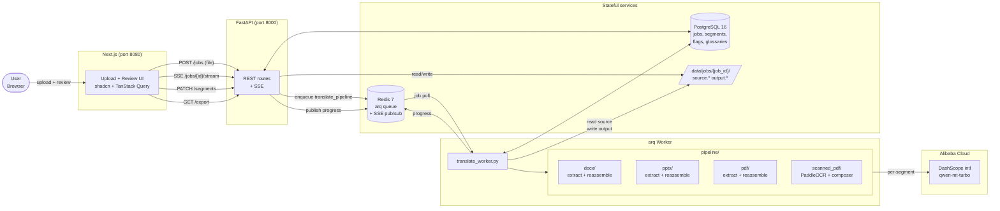
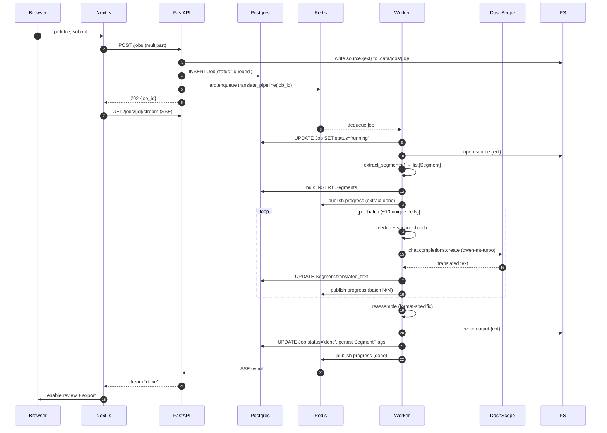

<!-- refreshed: 2026-05-13 -->

# AI Translation PoC — Architecture

Web-based document translation: DOCX / PPTX / PDF (native + scanned) → translated copy preserving original layout. Backend translates via Alibaba DashScope qwen-mt-turbo; frontend lets reviewers edit translated segments before export.

## System overview



## Component responsibilities

| Component | Responsibility | Entry file |
|-----------|----------------|------------|
| `frontend` (Next.js 16 / Turbopack) | Upload form, job list, per-segment review + inline edit, export trigger | `frontend/src/app/` |
| `api` (FastAPI 0.115+) | REST: upload, jobs, segments, glossaries, languages, export; SSE progress stream | `backend/src/app/api/routes/` |
| `worker` (arq 0.27) | Async pipeline: extract → translate → reassemble; persist segments + flags | `backend/src/app/workers/translate_worker.py` |
| `pipeline/docx` | python-docx run-level extraction; preserve bold/italic/comments/tracked changes | `pipeline/docx/{extractor,reassembler}.py` |
| `pipeline/pptx` | python-pptx shape/table/SmartArt traversal; auto-fit overflow detection | `pipeline/pptx/{extractor,reassembler}.py` |
| `pipeline/pdf` | PyMuPDF native PDF: block + table_cell extraction → redact-and-reinsert with Noto fonts | `pipeline/pdf/{extractor,reassembler,columns,fonts}.py` |
| `pipeline/scanned_pdf` | PaddleOCR PP-StructureV3 layout + OCR → composer renders translated overlay | `pipeline/scanned_pdf/{extractor,composer,detector,segment_to_md}.py` |
| `llm/translator` | DashScope client (openai SDK compat); dedup + sentinel-batched calls; placeholder masking | `backend/src/app/llm/translator.py` |
| `services/glossary` | Glossary CRUD + terminology API mapping + flag detection (overflow / refusal / placeholder mismatch) | `backend/src/app/services/glossary_service.py` |
| `db/models` | SQLAlchemy 2.0 async ORM: Job, Segment, SegmentFlag, Glossary | `backend/src/app/db/models.py` |

## Primary request flow — translation job



## Native PDF pipeline detail (most complex path)

```mermaid
flowchart TD
    Src[(source.pdf)]
    Src --> Ex[extract_pdf_segments]

    subgraph Extractor
        Ex --> FT[page.find_tables]
        FT --> CW{table.rows[r].cells[c]<br/>walk}
        CW -->|cell rect| EmitCell[emit kind=table_cell]
        FT --> BlockWalk[page.get_text dict<br/>→ text blocks]
        BlockWalk --> CentroidFilter[drop blocks whose<br/>centroid is in any cell rect]
        CentroidFilter --> ColClust[cluster_columns]
        ColClust --> EmitText[emit kind=text<br/>via spans_to_html]
    end

    EmitCell --> Segs[(Segments DB)]
    EmitText --> Segs

    Segs --> TR[translate_batch<br/>llm/translator.py]
    TR -->|dedup uniques| Batch{sentinel-batch<br/>'\|\|\|' separator}
    Batch -->|1 API call per ~10 uniques| Qwen[qwen-mt-turbo]
    Qwen --> Restore[restore CORE-05 placeholders<br/>+ cell-collision escapes]
    Restore --> Segs2[(translated_text per seg)]

    Segs2 --> RA[reassemble_pdf]
    subgraph Reassembler
        RA --> P0[Pass 0: same filter as extractor<br/>→ pos_to_block aligned]
        P0 --> P1[partition active_pairs<br/>kind dispatch:<br/>- identity skip<br/>- density skip<br/>- adaptive scale_low]
        P1 --> R1[Pass 1: add_redact_annot<br/>fill=None, per active rect]
        R1 --> R2[Pass 2: apply_redactions<br/>preserve images + line art]
        R2 --> R3[Pass 3: insert_htmlbox<br/>with adaptive scale_low<br/>+ inset for table_cell]
    end
    R3 --> Out[(output.pdf)]
    R3 --> Flags[(SegmentFlags:<br/>overflow / dense /<br/>image_collision / etc.)]
```

## Data flow constraints

| Constraint | Where enforced | Why |
|-----------|----------------|-----|
| CORE-03: `len(out) == len(in)` per translate call | `llm/translator.py` (translation_map lookup, not split-from-response) | Guards against model dropping/adding lines |
| CORE-04: NFC normalize at extract + after model | `pipeline/segment.py`, `llm/translator.py` | Stable IDs (sha256-based) across re-extractions |
| CORE-05: mask URLs / dates / `${vars}` to `⟦T{n}⟧` | `pipeline/placeholder.py` | Stops model translating identifiers |
| Sentinel rule: zero dictionary tokens | `llm/translator.py` — `_BATCH_SEP="\|\|\|"` + `⟦C{n}⟧` | Spike 001 showed `⟦CELL⟧` → `⟦Ô⟧` / `⟦細胞⟧` |
| Cell indexing: `table.rows[r].cells[c]` only | `pipeline/pdf/{extractor,reassembler}.py` | Flat `table.cells` is column-major; `r*col+c` returns wrong rect |
| Extractor + reassembler must use SAME block filter | `pipeline/pdf/reassembler.py` | Mismatched filters → `pos_to_block` misalignment → wrong rects redacted |

## Storage layout

```
.data/jobs/{job_id}/
  source.{docx,pptx,pdf}      # uploaded original
  output.{docx,pptx,pdf}      # reassembled translation
  pages/                       # scanned_pdf only — per-page renders for OCR

postgres (multi-tenant by job_id):
  jobs(id, status, source_lang, target_lang, input_format, glossary_id, ...)
  segments(job_id, id, seq, source_text, translated_text,
           structural_position, kind?, run_index, run_group_size, ...)
  segment_flags(segment_job_id, segment_id, flag_type, severity, details JSONB)
  glossaries + glossary_terms(many-to-many to jobs)

redis:
  arq:queue                   # arq job queue
  arq:job:{id}                # arq job state
  arq:in-progress:{id}        # currently running
  sse:{job_id}                # SSE pub/sub channel for progress
```

## Deployment

`docker-compose.yml`: 5 services on a single bridge network.

| Service | Image | Ports | Notes |
|---------|-------|-------|-------|
| api | ai-translation-backend:dev (FastAPI + uvicorn --reload) | 8000:8000 | mounts backend/src + .data |
| worker | same image | — | command: `arq app.workers.translate_worker.WorkerSettings` |
| web | ai-translation-web (Next.js dev) | **8080:3000** | host 8080 to avoid Windows-side port 3000 conflict |
| postgres | postgres:16-alpine | 5432:5432 | pgdata named volume |
| redis | redis:7-alpine | 6379:6379 | ephemeral |

External dependency: `https://dashscope-intl.aliyuncs.com/compatible-mode/v1` (Alibaba). API key in `.env`.

## Architectural constraints

- **Strict async**: every I/O path uses `asyncio` — `httpx.AsyncClient`, SQLAlchemy 2.0 async + asyncpg, arq, SSE
- **Per-segment immutability**: `Segment.id = sha256(source_text + structural_position)[:16]` — enables future translation-memory reuse without schema changes
- **Multi-tenant by job_id**: every segment query carries `job_id` in WHERE; compound PK `(job_id, id)` enforces tenant isolation at PK level
- **Worker isolation**: worker container does NOT serve HTTP. API container does NOT block on translation. Communication via Redis queue + Postgres state
- **Per-cell adaptive scale_low** (Phase 03.3): no fixed scale floor — each cell's max_fit_scale computed from `len(translation) × body_pt` vs `cell_w × cell_h`. Below readability floor `0.15` → skip (preserve source); else use as `insert_htmlbox` scale_low

## Anti-patterns explicitly avoided

| Avoided pattern | Why | What we use instead |
|-----------------|-----|---------------------|
| Newline-joined batch translation | qwen-mt drifts line count (142 → 151 on real JA doc) | Per-call dedup + `\|\|\|` sentinel batch with count-mismatch fallback |
| `paragraph.text = value` (python-docx) | Destroys run-level formatting | Overwrite first run's `.text`, blank remaining runs |
| `table.cells[r * col + c]` (PyMuPDF) | Returns column-0 stacked strip (col-major flat array) | `table.rows[r].cells[c]` |
| Fixed `_TABLE_SCALE_LOW = 0.3` | Wrong for any cell where translation length differs | Per-cell adaptive scale via single-line-fit geometry |
| Filter blocks by `table.bbox` | Drops prose blocks inside table bounding rect | Drop only blocks whose centroid falls inside a cell rect |
| `gsd-tools.cjs config-get` in tight loop | Spawns Node process per call | `gsd-sdk query` (Phase 3 SDK migration) |
| `BackgroundTasks` for translation | No persistence, no status, dies on restart | arq workers + Postgres-backed Job rows |

---
*Generated 2026-05-13. Refresh via `/gsd-map-codebase --focus arch` or `/gsd-scan --focus arch` after significant architecture changes.*
